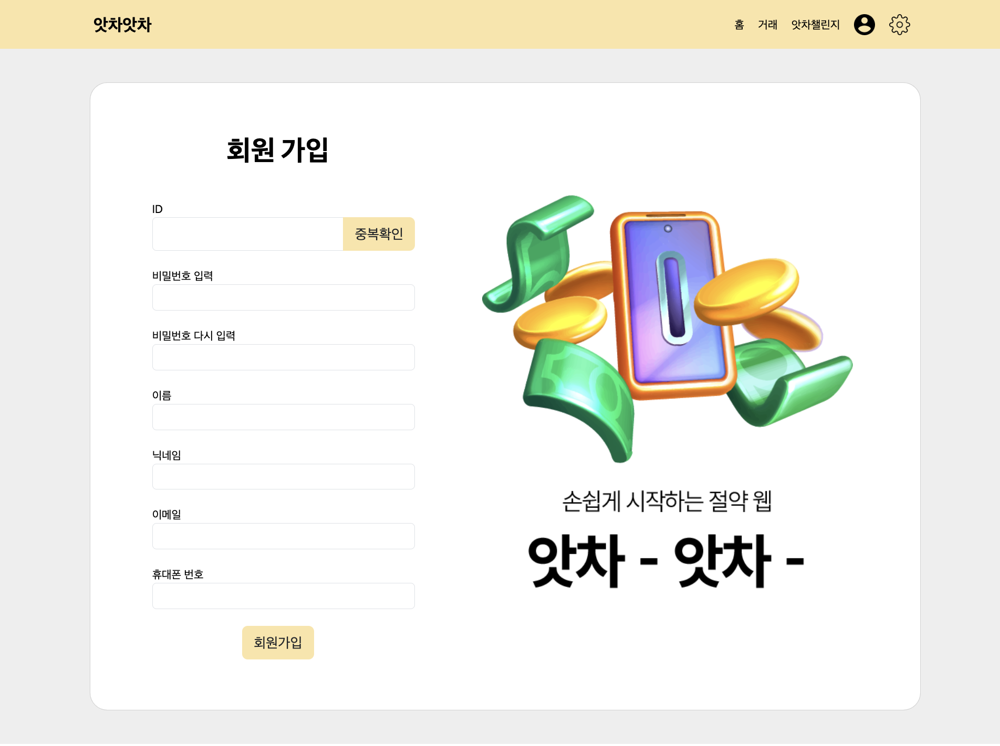
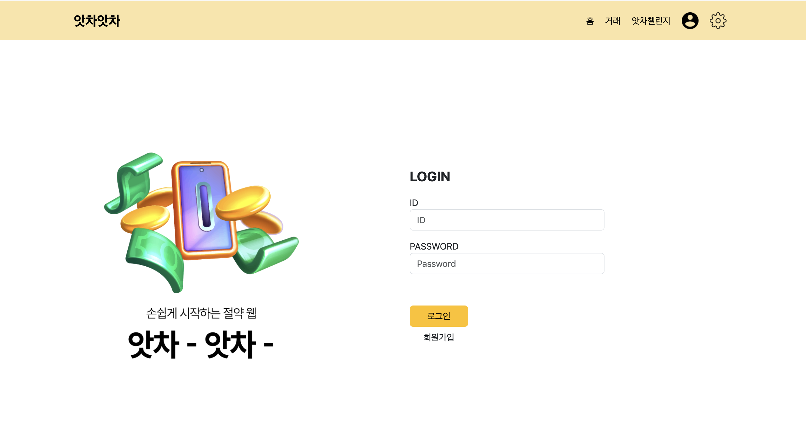
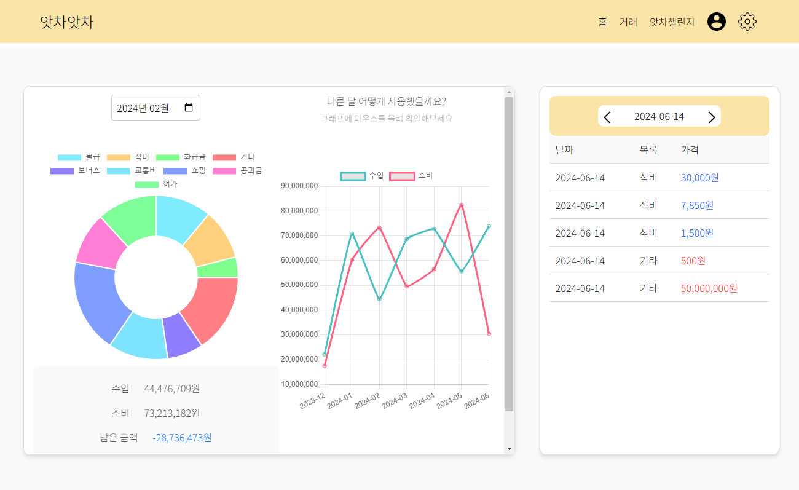
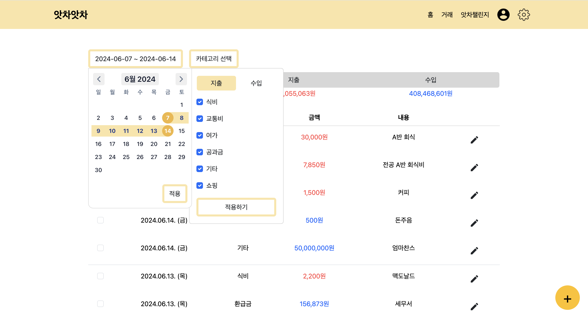
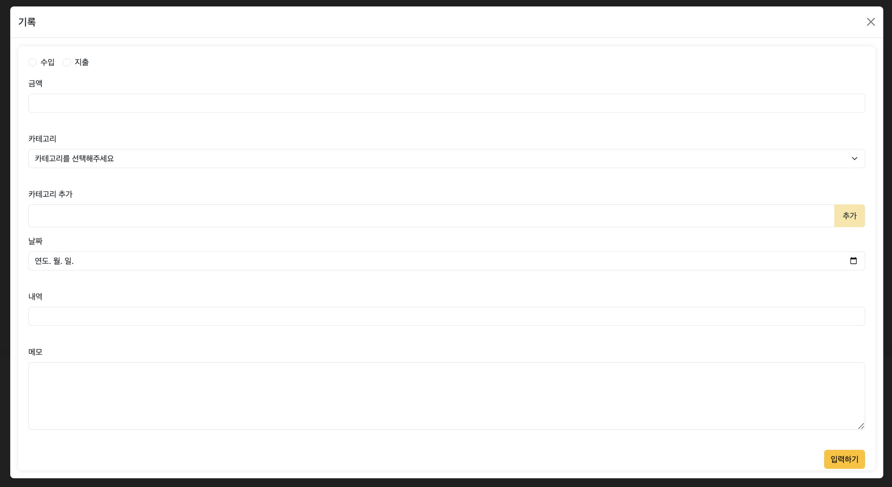
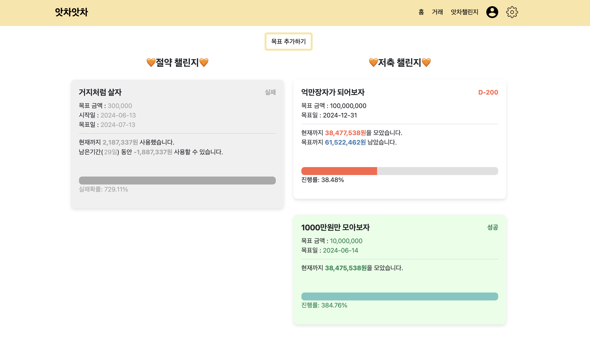
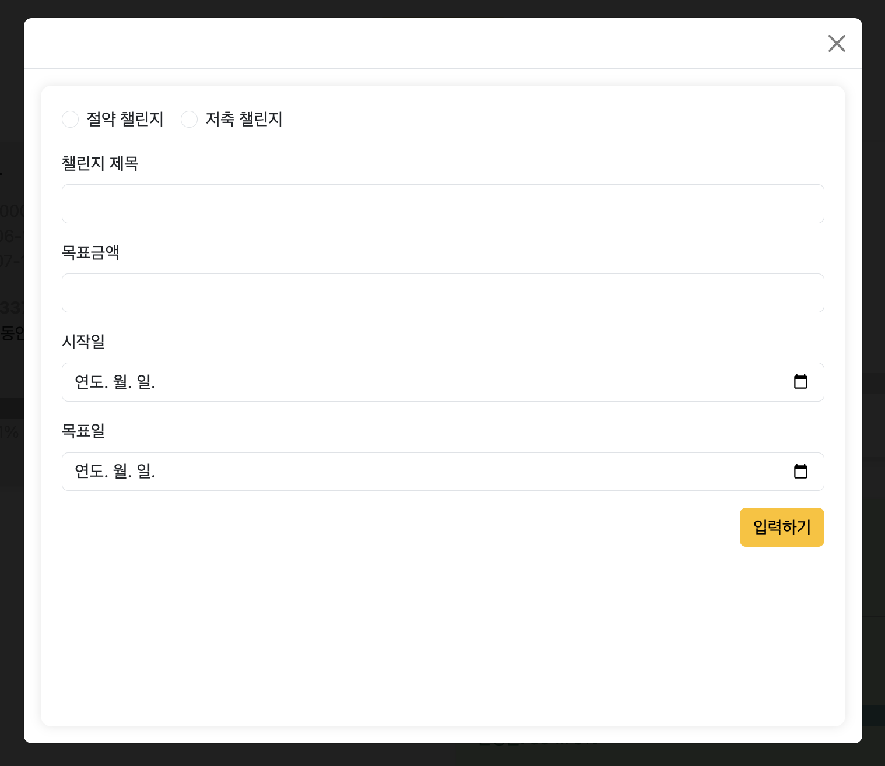
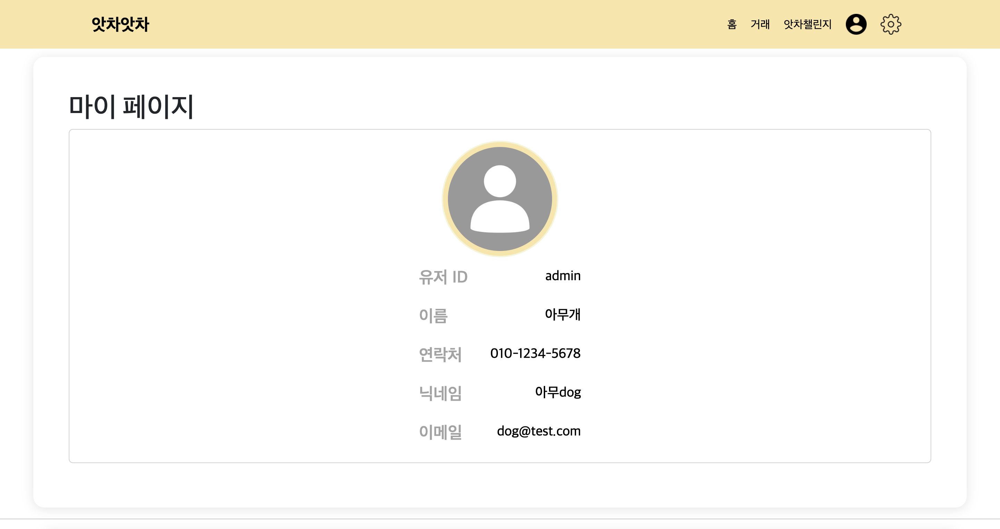
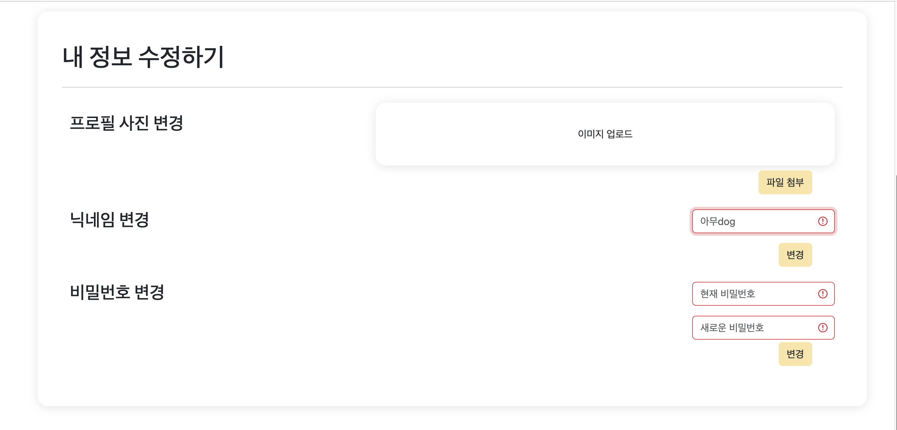

# 앗차앗차 (가계부 프로젝트)

   
  
   

## 프로젝트 소개

KB IT's Your Life의 Vue.js 교육 과정을 이수한 후 진행한 프로젝트입니다. 지출과 수입을 관리하는 가계부 기능을 구현하였습니다. 

 

## 기술 스택

| JavaScript | Vue |  Bootstrap 5   |     
| :--------: | :--------: | :------: | 
|       |       |  | 

 

## 구현 기능

### 회원가입 및 로그인 화면 

회원 정보를 입력하여 회원가입 및 로그인을 수행합니다. 사용자 정보를 입력한 후 홈 화면으로 이동합니다.

 

### 홈 화면 

최근 거래 내역을 목록 형식으로 보여주고, 전체 거래 내역 분석 결과를 그래프로 나타냅니다.

<ul>
  <li>최근 거래 내역 확인</li>
  <li>꺾은선 그래프를 이용한 월별 수입 및 지출 요약</li>
  <li>도넛 그래프를 이용한 카테고리별 수입 및 지출 요약</li>
</ul>
 

### 거래 내역 화면 

전체 거래 내역을 확인할 수 있습니다.

<ul>
  <li>거래 내역 전체 보기</li>
  <li>기간별, 카테고리별 필터링 기능</li>
  <li>거래 내역 삭제 및 수정 기능</li>
  <li>우측 하단의 + 버튼을 이용한 거래 내역 추가</li>
</ul>
 

### 거래 등록 화면 

새로운 거래를 등록할 수 있습니다.

<ul>
  <li>거래 내역 전체 보기</li>
  <li>기간별, 카테고리별 필터링 기능</li>
  <li>거래 내역 삭제 및 수정 기능</li>
  <li>우측 하단의 + 버튼을 이용한 거래 내역 추가</li>
</ul>
 

### 목표 (챌린지) 화면

전체 등록된 챌린지를 확인할 수 있습니다.

<ul>
  <li>절약 챌린지 기능</li>
  <li>저축 챌린지 기능</li>
  <li>목표 설정</li>
  <li>목표 달성 여부 확인</li>
</ul>
 

### 목표 (챌린지) 등록 화면

새로운 목표를 등록할 수 있습니다.

<ul>
  <li>목표 설정</li>
  <li>목표 달성 여부 확인</li>
</ul>
 

### 프로필 관리 화면

사용자 프로필을 확인 및 수정할 수 있습니다.

<ul>
  <li>프로필 정보 수정</li>
  <li>비밀번호 변경</li>
</ul>
 

 

## 라이센스

<!-- Stack Icon References -->

[js]: ./images/readme/javascript.svg
[vue]: ./images/readme/vue.svg
[bootstrap]: ./images/readme/bootstrap.svg
